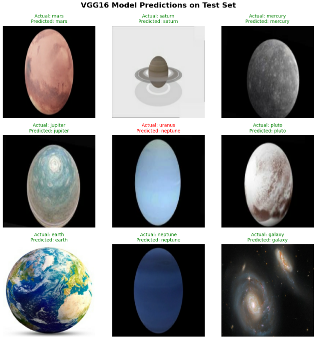

# Astrophysical Body Image Classifier using Convolutional Neural Networks (VGG16)

*Sample predictions across 12 astrophysical object classes*

## The Problem
Astronomical surveys generate images faster than they can be manually
labeled. This project fine-tunes VGG16 via transfer learning to classify
12 astrophysical object classes (galaxies, nebulae, star clusters, etc.)
from image data.

*Note: this model was built as part of a 3-person team project where each
member independently designed and implemented a full pipeline (VGG16,
ResNet50, and a custom CNN respectively) on a shared dataset, to compare
architectures under the same problem. This repo contains my end-to-end
VGG16 implementation — data pipeline, augmentation, training, and
evaluation — built independently.*

## Results
| Metric | VGG16 |
|---|---|
| Validation Accuracy | 97.26% |
| Test Accuracy | 94.78% |

*For context, across the team's three architectures on the same dataset/
split, ResNet50 led (96.22% test), VGG16 was second (94.78%), and the
custom CNN followed (93.04%) — full comparison in [Project Report.pdf].*

## Approach
- Transfer learning on ImageNet-pretrained VGG16, base layers frozen
- Data augmentation (rotation, shear, zoom, flip) to offset limited
  training data (2,416 images across 12 classes)
- Grid search over learning rate {0.0001, 0.001, 0.01} and weight decay
  {0, 0.0001, 0.001} — found lr=0.001 optimal; higher lr overshot convergence
- Dropout (p=0.5) + new dense layers on top of frozen VGG16 base

## Dataset
1.5GB, 12 classes (Asteroid, Black Hole, Earth, Galaxy, Jupiter, Mars,
Mercury, Neptune, Pluto, Saturn, Uranus, Venus), pre-split into
2,416 train / 658 val / 345 test images.
[Kaggle source](https://www.kaggle.com/code/a3amat02/astrophysical-objects-classification-using-resnet#ResNet-fine-tuning-process-and-training-logs)

## Full Writeup
See [Project Report.pdf] for the complete methodology and results
across all three architectures compared by the team.
